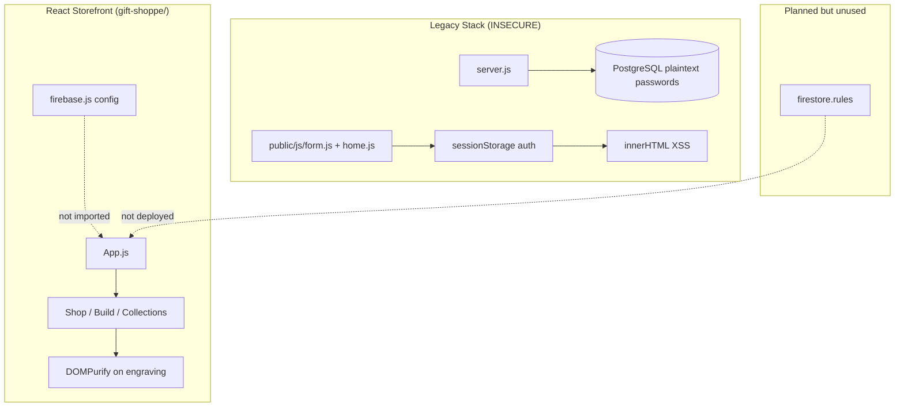

# React Shoppe — Security Audit Report

**Scope:** `gift-shoppe/` (React app, Cypress, Firestore rules), root `server.js`, `firebase.js`, `.env`, `.gitignore`  
**Date:** June 28, 2026  
**Method:** Static analysis of all non-`node_modules` source files

---

## 1. Executive Summary

The project contains **two disconnected stacks**: a legacy Express/PostgreSQL login server with critical authentication flaws, and a modern React storefront with **no real authentication, cart persistence, or checkout**. Passwords are stored and compared in plaintext, database credentials are hardcoded, and legacy client scripts use `sessionStorage` plus `innerHTML`, creating stored/reflected XSS and trivial auth bypass. Firebase configuration and well-written Firestore rules exist but are **not wired into the React app**, so they provide no runtime protection. The Custom Gift Builder is the strongest area, with DOMPurify and input filtering.

---

## 2. Severity Breakdown

| Severity | Count |
|----------|-------|
| **Critical** | 5 |
| **High** | 7 |
| **Medium** | 8 |
| **Low** | 5 |
| **Info** | 4 |
| **Total** | **29** |

---

## 3. Detailed Findings

Sorted by severity (highest first).

| Severity | Location (file:line) | Finding | Recommendation |
|----------|----------------------|---------|----------------|
| **Critical** | `server.js:41-44` | Passwords inserted into PostgreSQL **in plaintext** on registration. | Hash with bcrypt or argon2 before storage; never persist raw passwords. |
| **Critical** | `server.js:61-66` | Login authenticates by matching **plaintext password** in SQL `WHERE` clause. | Compare password hashes with constant-time comparison (`bcrypt.compare`). |
| **Critical** | `server.js:8-13` | PostgreSQL credentials **hardcoded** (`user: 'postgres'`, `password: 'test'`). | Move all DB config to environment variables; rotate credentials immediately. |
| **Critical** | `gift-shoppe/public/js/home.js:7` | User-controlled `sessionStorage.name` rendered via **`innerHTML`** — stored XSS if name contains HTML/JS. | Use `textContent` instead of `innerHTML`; sanitize on registration server-side. |
| **Critical** | `gift-shoppe/public/js/form.js:72` | Server error strings assigned to **`alertMsg.innerHTML`** without escaping — DOM XSS if response ever includes user input. | Use `textContent`; return structured error codes, not raw strings in HTML. |
| **High** | `gift-shoppe/public/js/form.js:63-65`, `home.js:4-8` | **Client-only auth** via `sessionStorage` — no server session, JWT, or Firebase token; anyone can set `sessionStorage.name` to bypass “login”. | Implement server-side sessions or Firebase Auth; validate identity on every protected request. |
| **High** | `firebase.js:9-16`, `gift-shoppe/src/firebase.js:3-9` | Full Firebase config including **API key committed** to source (two copies). | Use `REACT_APP_*` env vars; restrict API key by HTTP referrer in Google Cloud Console. |
| **High** | `gift-shoppe/src/App.js:17-33`, `Header.js:50-58` | Nav links to `/account`, `/cart`, `/checkout`, `/wishlist` with **no routes or auth guards** — open access to any page that gets added later. | Add `PrivateRoute`/guards; implement auth before exposing sensitive routes. |
| **High** | `gift-shoppe/src/firebase.js:1-10` | Firebase config defined but **never imported or initialized** — Firestore rules are dead code at runtime. | Wire up `initializeApp`, Auth, and Firestore; deploy rules with `firebase deploy`. |
| **High** | `gift-shoppe/firestore.rules:38` | Order `create` only checks `userId` match — **no validation** of `total`, `items`, or `status`; clients could create $0 orders when Firebase is integrated. | Validate required fields, types, and price ranges in rules or via Cloud Functions. |
| **High** | `server.js:35-74` | POST `/register-user` and `/login-user` have **no CSRF protection** and no rate limiting — credential stuffing and CSRF possible. | Add CSRF tokens, `express-rate-limit`, and account lockout policies. |
| **High** | `gift-shoppe/build/index.html:1` vs `public/index.html:12` | **CSP meta tag present in source but absent from production build** — deployed app loses CSP protection. | Inject CSP via build plugin, server headers, or hosting config (e.g. Firebase Hosting headers). |
| **Medium** | `server.js:38-39` | Validation failure calls `res.json(...)` but **does not `return`** — execution may fall through and still attempt DB insert. | Add `return res.status(400).json(...)` on all validation failures. |
| **Medium** | `server.js:50-54` | `err.detail.includes(...)` without null guard — can throw and **leak stack traces**. | Use optional chaining (`err.detail?.includes`) and generic client-facing errors. |
| **Medium** | `server.js:16-21` | No **security middleware** — missing `helmet`, CORS policy, HTTPS redirect, request size limits. | Add `helmet`, explicit CORS whitelist, `express.json({ limit: '10kb' })`, TLS in production. |
| **Medium** | `gift-shoppe/public/index.html:12` | CSP allows **`'unsafe-inline'`** and **`'unsafe-eval'`** for scripts — weakens XSS mitigation. | Use nonces/hashes; remove `unsafe-eval` in production builds. |
| **Medium** | `gift-shoppe/public/index.html:26` | **FontAwesome Pro CDN** — external dependency, potential license exposure, supply-chain risk. | Self-host icons or use `@mui/icons-material` (already in root `package.json`). |
| **Medium** | `.gitignore:1-2` (root) | Root `.gitignore` only lists `node_modules/` and `package-lock.json` — **`.env` is not ignored**. | Add `.env`, `.env.*`, `*.pem`, `credentials.json`; audit git history for leaks. |
| **Medium** | `gift-shoppe/.gitignore:15-19` | Ignores `.env.local` variants but **not plain `.env`**. | Add `.env` to `gift-shoppe/.gitignore`. |
| **Medium** | `gift-shoppe/public/js/form.js`, `public/js/home.js` | **Orphaned legacy login scripts** still ship in `public/` and `build/js/` — vulnerable code in deployable artifacts. | Remove unused scripts; do not bundle legacy auth with the React SPA. |
| **Medium** | `gift-shoppe/cypress/e2e/security.cy.js:3-52` | Security E2E tests target `/custom-gift`, `/checkout`, `/login` — **routes/UI don't exist** in current `App.js`; tests give false assurance. | Align tests with `/build` route and actual auth implementation. |
| **Low** | `gift-shoppe/src/ErrorBoundary.js:27-31` | Full **error stack traces** shown to users in `
` block. | Hide details in production; log to Sentry/monitoring only. |
| **Low** | `server.js:76-78` | Server binds to all interfaces on port 3000 with no TLS. | Bind `127.0.0.1` in dev; terminate TLS at reverse proxy in production. |
| **Low** | `package.json:23` (root) | Dependency **`express.js@^1.0.0`** — not the official `express` package; `server.js` uses `require('express')` which may resolve incorrectly. | Replace with `express@^4.x`; remove `express.js` typosquat package. |
| **Low** | `package.json:26` (root) | **`nodemon@2.0.7`** — outdated with known advisories. | Upgrade to nodemon 3.x or remove if unused. |
| **Low** | `gift-shoppe/src/ProductCard.js:7-11`, `CustomGiftBuilder.js:35-37` | “Add to Cart” is **UI-only** — no server-side cart, inventory, or price validation. | Implement server-authoritative cart/checkout before accepting payments. |
| **Info** | `gift-shoppe/src/CustomGiftBuilder.js:122-129` | **Good:** Two-layer XSS defense (regex + DOMPurify) on engraving input. | Extend this pattern to all user-generated content fields. |
| **Info** | `gift-shoppe/firestore.rules:48-51` | **Good:** Default deny catch-all for unmatched paths. | Deploy when Firebase is integrated. |
| **Info** | `gift-shoppe/firestore.rules:28-30` | **Good:** Products collection is read-only from clients (`allow write: if false`). | Keep product writes on Admin SDK / Console only. |
| **Info** | `gift-shoppe/src/CustomGiftBuilder.test.js:8-37` | **Good:** Unit test verifies XSS payload stripping on engraving input. | Add similar tests for any new user-input surfaces. |

---

## 4. Positive Security Practices Found

- **DOMPurify + regex filtering** on the Custom Gift Builder engraving field (`CustomGiftBuilder.js:122-129`)
- **Content-Security-Policy** meta tag in development `index.html` (though weakened and stripped in build)
- **Firestore rules** follow least-privilege: owner-scoped users/carts, read-only products, immutable orders, default deny
- **React ErrorBoundary** wraps the app to prevent full white-screen crashes (`index.js:12-14`)
- **React JSX auto-escaping** protects product names rendered in components
- **Dedicated security unit test** for XSS in `CustomGiftBuilder.test.js`
- **`dompurify@^3.3.3`** dependency explicitly added for sanitization

---

## 5. Priority Remediation Roadmap (Top 5)

| # | Action | Rationale | Est. Effort |
|---|--------|-----------|-------------|
| **1** | **Retire or harden `server.js`** — bcrypt hashing, env-based DB config, `return` on validation, rate limiting, remove plaintext auth | Addresses 3 Critical findings and multiple High/Medium issues in the worst attack surface | 4–6 hours |
| **2** | **Remove legacy `public/js/form.js` and `home.js`** (and from `build/`) — eliminate `innerHTML` + `sessionStorage` auth bypass | Stops XSS and fake-auth paths in deployable artifacts | 1–2 hours |
| **3** | **Fix `.gitignore` at root and in `gift-shoppe/`** — add `.env`, audit git history for committed secrets | Prevents future credential leaks (Critical if `.env` grows) | 1 hour |
| **4** | **Integrate Firebase Auth + deploy `firestore.rules`** — single config via env vars; add order field validation in rules | Replaces broken auth model; activates the security rules already written | 1–2 days |
| **5** | **Restore CSP in production** and tighten policy (remove `unsafe-eval`, minimize `unsafe-inline`) | Closes XSS blast radius for the React SPA | 2–4 hours |

---

## Architecture Note

The legacy Express server and orphaned `public/js` scripts should be treated as **actively dangerous** if either is deployed or reachable. The React app is currently a **static catalog** with simulated cart behavior — not a secure e-commerce backend.

---

*This report is based on static code review. Dynamic testing (penetration test, `npm audit`, Firebase rules simulator) would supplement these findings.*

---

*Report generated by specialized audit agent — React Shoppe Full Application Audit, June 28, 2026*
