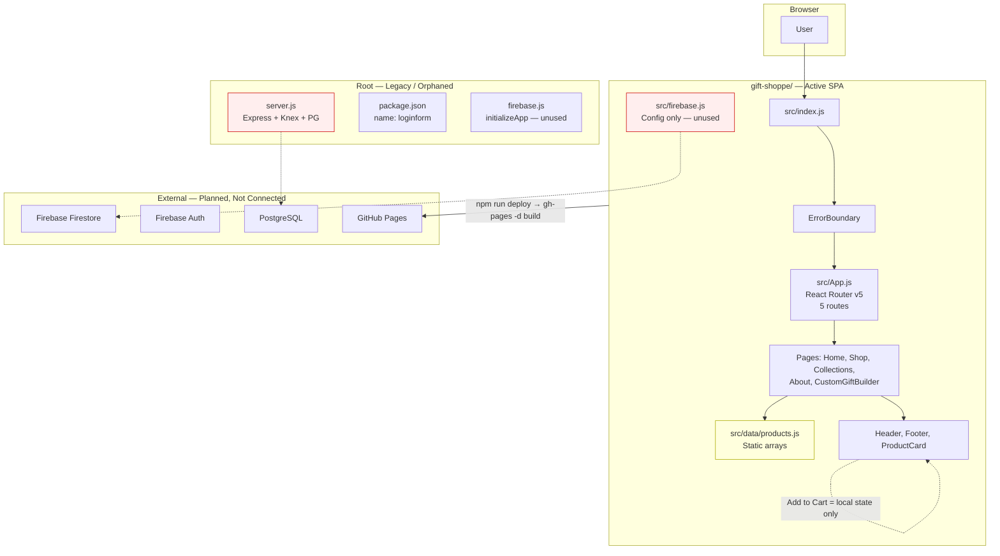
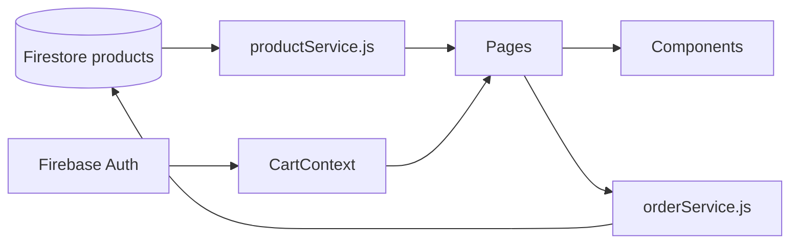

# React Shoppe — Architecture & Structure Audit

**Scope:** `d:\desktop\Web Development\React Shoppe`  
**Primary app:** `d:\desktop\Web Development\React Shoppe\gift-shoppe\`  
**Audit date:** June 28, 2026

---

## 1. Executive Summary

React Shoppe is **not a single application** — it is two unrelated codebases sharing a folder:

| Layer | Location | Purpose | Status |
|-------|----------|---------|--------|
| **Active storefront** | `gift-shoppe/` | React 18 CRA SPA (GiftShoppe) | **This is the real app** |
| **Legacy backend shell** | Root (`server.js`, root `package.json`) | Express + Knex + PostgreSQL login API | **Orphaned, not used by SPA** |
| **Scaffolded cloud backend** | `gift-shoppe/firestore.rules`, `firebase.js` (×2) | Firebase Auth/Firestore | **Configured but not wired** |

The live app in `gift-shoppe/src/` is a **static, client-only storefront**: products come from `gift-shoppe/src/data/products.js`, “Add to Cart” only toggles local button state, and navigation links to cart, account, checkout, and ~12 other routes that **do not exist** in `gift-shoppe/src/App.js`. Firebase SDK initialization, cart persistence, auth, and order flows are all absent despite UI and rules suggesting they were planned.

Structural debt is high:

- **Dual `package.json`** with conflicting names, dependencies, and `react-router-dom` major versions (v5 vs v6).
- **Flat `src/` layout** — no `pages/`, `components/`, `hooks/`, `context/`, or `services/` layers.
- **Nested Git repo** inside `gift-shoppe/` while the workspace root is not a Git repo.
- **Legacy static assets** (`gift-shoppe/public/js/form.js`, `public/css/style.css`) from an old login/e-commerce template coexist with the React app.
- **Tests and deploy config are out of sync** with the actual UI (Cypress references routes/selectors that no longer exist; `gift-shoppe/package.json` omits `react-scripts` and `cypress`).

The app is suitable as a **UI prototype/demo**. It is **not scalable as an e-commerce platform** without consolidation, state management, a data service layer, and route/IA alignment.

---

## 2. Current Architecture Diagram

### Repository layout (actual)

```
d:\desktop\Web Development\React Shoppe\
├── docs\                          # Prior audit reports (01–05)
├── gift-shoppe\                   # ★ Active React app (nested .git repo)
│   ├── .git\
│   ├── build\                     # Local build output (gitignored, on disk)
│   ├── cypress\                   # E2E tests (outdated vs app)
│   ├── img\                       # Duplicate asset tree (also under public/img/)
│   ├── public\
│   │   ├── index.html             # CRA shell + CSP
│   │   ├── img\                   # Product/banner images (f1.jpg, p1.jpg, etc.)
│   │   ├── css\                   # Legacy template CSS (style.css ~1200 lines)
│   │   └── js\                    # Legacy login scripts (form.js, home.js)
│   ├── src\                       # Flat — 16 JS files, 1 subfolder (data/)
│   │   ├── App.js                 # Router (5 routes)
│   │   ├── Home.js, Shop.js, Collections.js, About.js
│   │   ├── Header.js, Footer.js, ProductCard.js, CustomGiftBuilder.js
│   │   ├── data/products.js       # Static product catalog
│   │   └── firebase.js            # Config object only — never imported
│   ├── firestore.rules            # Well-written rules — not deployed/used
│   ├── package.json               # Missing react-scripts in dependencies
│   └── tailwind.config.js
├── node_modules\                  # Root-level deps (loginform package)
├── server.js                      # Express login API (expects root public/ — missing)
├── firebase.js                    # ESM Firebase init (unused by SPA)
├── package.json                   # name: "loginform", react-router v6, no react/react-dom
├── tailwind.config.js             # Points to ./src/** — no src/ at root
├── .env                           # Present at root (not audited for contents)
└── .gitignore                     # Minimal: only node_modules + package-lock.json
```

### System diagram (Mermaid)



### Data flow (current)

```
gift-shoppe/src/data/products.js
    → imported by Home.js, Shop.js, Collections.js
    → passed as props to ProductCard.js
    → rendered in UI (images from /img/Products/*.jpg in public/)

User clicks "Add to Cart" (ProductCard.js / CustomGiftBuilder.js)
    → local useState toggle / toast only
    → NO CartContext, localStorage, Firestore, or API

Header.js links (/cart, /account, /search, …)
    → React Router matches nothing
    → blank <main> (no 404 handler)

server.js POST /login-user, /register-user
    → PostgreSQL via Knex
    → NEVER called by gift-shoppe React app
    → legacy public/js/form.js would call it, but that script is not loaded by CRA index.html

firestore.rules (users, products, orders, carts)
    → not deployed; no client SDK usage
```

---

## 3. Structural Issues Table

| Severity | Area | Issue | Recommendation |
|----------|------|-------|----------------|
| **Critical** | Project layout | Two independent apps: root (`server.js`, `loginform` package) vs `gift-shoppe/` CRA app with **no workspace tooling** | Make `gift-shoppe/` the single root OR use npm/pnpm workspaces; delete or move legacy root files |
| **Critical** | Package integrity | `gift-shoppe/package.json` scripts use `react-scripts` but **`react-scripts` is not listed** in dependencies; lockfile also lacks it | Add `react-scripts@5` to `gift-shoppe/package.json`; run fresh `npm install` and verify `npm start` / `npm run build` |
| **Critical** | Data layer | **No API/service layer** — all catalog data in `gift-shoppe/src/data/products.js` | Add `src/services/productService.js`; fetch from Firestore or REST; keep static data as dev fallback only |
| **Critical** | Backend integration | `gift-shoppe/src/firebase.js` exports config only; **`initializeApp` never called**; root `firebase.js` initializes but is unused by SPA | Single `src/services/firebase.js` with env-based config + Auth/Firestore exports; import in app bootstrap |
| **Critical** | E-commerce core | **Cart is fake** — `ProductCard.js` and `CustomGiftBuilder.js` only toggle UI; `Header.js` hardcodes `₹0.00` | Implement `CartContext` + `/cart` page or remove cart UI/links |
| **High** | Package management | **react-router-dom v5** in `gift-shoppe/package.json` (`Switch`, `activeClassName`) vs **v6** in root `package.json` (`Routes`, `element`) | Upgrade `gift-shoppe` to v6; refactor `App.js` |
| **High** | Package management | Root `package.json` name is `"loginform"`; lists **MUI, Firebase, react-scripts, react-router v6** but has **no `react` or `react-dom`** and **no `src/`** | Rename package; remove unused deps or merge into `gift-shoppe` |
| **High** | Package management | Root depends on `"express.js": "^1.0.0"` (wrapper package) while `server.js` uses `require('express')` | Use `"express"` directly in root `package.json` |
| **High** | Routing | **5 routes defined**, **15+ nav/footer links** with no matching routes (`/cart`, `/account`, `/search`, `/wishlist`, `/track-order`, `/checkout`, `/login`, `/faq`, etc.) | Route inventory doc; implement pages or remove links; add catch-all 404 |
| **High** | Routing | Cypress tests use **`/custom-gift`**; app route is **`/build`** (`gift-shoppe/src/App.js`) | Align tests and routes to one canonical path |
| **High** | State management | **No Context, Redux, or Zustand** — no global cart, auth, or wishlist despite UI affordances | Add `src/context/CartContext.js`, `AuthContext.js` at `App.js` root |
| **High** | Git structure | **`gift-shoppe/.git`** is a nested repo; workspace root has **no `.git`** | Single repo at workspace root; remove nested `.git` or convert to submodule intentionally |
| **High** | Security (legacy) | `server.js` stores **plaintext passwords**, hardcoded DB creds (`password: 'test'`), missing `return` on validation failure (lines 38–39) | Remove server or secure with bcrypt, env vars, proper error responses |
| **High** | Secrets | Firebase API key hardcoded in `gift-shoppe/src/firebase.js` and root `firebase.js` | Move to `REACT_APP_*` env vars; add `.env.example` |
| **Medium** | Component architecture | **Flat `src/`** — pages, layout, and UI mixed at same level | Reorganize: `pages/`, `components/`, `layouts/`, `hooks/`, `services/` |
| **Medium** | Duplication | `CustomGiftBuilder` embedded in `Home.js:55` **and** routed at `/build` in `App.js:21-23` | Keep one: link from Home to `/build` or route-only |
| **Medium** | Duplication | Product images in **`gift-shoppe/img/`** and **`gift-shoppe/public/img/`** (Git shows both trees staged) | Consolidate under `public/img/` only |
| **Medium** | Legacy assets | `gift-shoppe/public/js/form.js`, `home.js`, `public/css/style.css` are **old login/template code** not loaded by CRA `index.html` | Delete or move to `legacy/` archive |
| **Medium** | CSS / Tailwind | Tailwind configured in **`gift-shoppe/tailwind.config.js`** and **root `tailwind.config.js`**; `@tailwind` in `index.css` but **no `postcss.config.js`** found; most styling is custom CSS + inline styles | Single Tailwind setup with PostCSS, or remove Tailwind and standardize on CSS modules |
| **Medium** | Deployment | Root `package.json` homepage: `https://praviadari.github.io/React-Shoppe.github.io/` (**malformed URL**); `gift-shoppe/package.json` has **no `homepage` field** | Set correct GitHub Pages URL on the app that actually builds |
| **Medium** | Deployment | `BrowserRouter` in `App.js` with **no `basename`** — breaks on project-site GitHub Pages subpaths | Add `basename={process.env.PUBLIC_URL}` or switch to `HashRouter` for gh-pages |
| **Medium** | Build artifacts | `gift-shoppe/build/` **exists on disk** (local artifact); **gitignored** (`.gitignore:12:/build`) — not currently tracked | Keep gitignored; deploy via CI from fresh build, never commit |
| **Medium** | Testing | Cypress in `gift-shoppe/cypress/` but **not in `package.json` devDependencies**; all 9 E2E tests reference non-existent UI (`.cart-modal`, `.cart-count`, `/checkout`) | Add Cypress dep; rewrite E2E against actual selectors/routes |
| **Medium** | Testing | Only **`ProductCard.test.js`** and **`CustomGiftBuilder.test.js`** exist (~14% file coverage); `Shop.js`, `App.js`, routing untested | Expand unit/integration tests for routes and filters |
| **Medium** | Firebase | `firestore.rules` is well-designed but **no `firebase.json`**, no deployment pipeline | Add Firebase project config; deploy rules with `firebase deploy --only firestore:rules` |
| **Low** | Naming | `gift-shoppe/src/firebase.js` exports config object, not Firebase app instance | Rename to `firebaseConfig.js` or complete initialization |
| **Low** | Documentation | `gift-shoppe/README.md` is default CRA boilerplate | Document setup, env vars, deploy, and which folder is canonical |
| **Low** | Root `.gitignore` | Only ignores `node_modules/` and `package-lock.json` — misses `.env`, `build/`, logs | Adopt `gift-shoppe/.gitignore` patterns at workspace root |
| **Low** | Product data | Duplicate name `"Creative Photo Frame"` for `n4` and `n8` in `products.js:14,17` | Deduplicate or rename |
| **Low** | Git hygiene | Many important files **untracked** in `gift-shoppe` git: `Shop.js`, `Footer.js`, `About.js`, `ErrorBoundary.js`, tests, Cypress, `firestore.rules` | Stage and commit or clarify repo state |

---

## 4. Recommended Target Architecture

### Folder structure

```
gift-shoppe/                          # Single canonical app root
├── public/
│   └── img/                          # Sole asset location
├── src/
│   ├── app/
│   │   ├── App.js                    # Router + providers
│   │   └── routes.js                 # Central route config
│   ├── components/
│   │   ├── layout/                   # Header.js, Footer.js, ErrorBoundary.js
│   │   ├── product/                  # ProductCard.js, ProductGrid.js
│   │   └── ui/                       # Button, Toast, Modal
│   ├── pages/
│   │   ├── HomePage.js
│   │   ├── ShopPage.js
│   │   ├── CollectionsPage.js
│   │   ├── BuildPage.js              # CustomGiftBuilder wrapper
│   │   ├── CartPage.js
│   │   ├── AboutPage.js
│   │   └── NotFoundPage.js
│   ├── context/
│   │   ├── CartContext.js
│   │   └── AuthContext.js
│   ├── hooks/
│   │   ├── useCart.js
│   │   ├── useProducts.js
│   │   └── useAuth.js
│   ├── services/
│   │   ├── firebase.js               # initializeApp + getFirestore + getAuth
│   │   ├── productService.js
│   │   └── orderService.js
│   ├── data/
│   │   └── products.mock.js          # Dev-only fallback
│   ├── utils/
│   │   └── sanitize.js               # Extract DOMPurify logic from CustomGiftBuilder
│   ├── styles/
│   │   ├── index.css
│   │   └── variables.css
│   └── index.js
├── cypress/
├── firestore.rules
├── firebase.json
├── .env.example
├── .github/workflows/ci.yml
└── package.json                      # Single source of truth
```

### Target data flow



### Package.json target (single file)

- **One** `package.json` at app root with: `react`, `react-dom`, `react-scripts`, `react-router-dom@6`, `firebase`, `dompurify`, `gh-pages`
- Remove from storefront package: unused Express/Knex/pg/MUI unless backend is intentionally co-located
- Add: `cypress` as devDependency if E2E is kept

### Routing target

| Route | Page | Status today |
|-------|------|--------------|
| `/` | Home | ✅ Exists |
| `/shop` | Shop | ✅ Exists |
| `/build` | Custom Gift Builder | ✅ Exists |
| `/collections` | Collections | ✅ Exists |
| `/about` | About | ✅ Exists |
| `/cart` | Cart | ❌ Missing |
| `/account` | Account | ❌ Missing |
| `*` | NotFound | ❌ Missing |
| All other footer/header links | — | Remove or implement |

---

## 5. Migration / Refactor Roadmap

### Phase 0 — Stabilize (Days 1–2)

1. **Pick canonical root:** Treat `gift-shoppe/` as the only app.
2. **Fix `gift-shoppe/package.json`:** Add `react-scripts`, verify `npm install && npm start && npm run build`.
3. **Fix deployment config:** Add correct `homepage` field; set `basename` on router for gh-pages.
4. **Git cleanup:** Flatten to one repo; commit untracked files (`Shop.js`, `Footer.js`, tests, `firestore.rules`).
5. **Archive root legacy:** Move `server.js`, root `package.json`, root `firebase.js` to `legacy/` or delete if confirmed unused.

### Phase 1 — Structure & routing (Week 1)

1. Reorganize `gift-shoppe/src/` into `pages/`, `components/`, `layouts/`.
2. Add `NotFoundPage.js` and catch-all route in `App.js`.
3. Audit all links in `Header.js` and `Footer.js` — implement `/cart` placeholder or remove dead links.
4. Remove duplicate `CustomGiftBuilder` from `Home.js` (keep `/build` route only).
5. Consolidate `img/` → `public/img/`; delete legacy `public/js/`, unused `public/css/`.
6. Remove duplicate root `tailwind.config.js` or root `node_modules` if no longer needed.

### Phase 2 — Core e-commerce state (Week 2)

1. Implement `CartContext` with `localStorage` persistence.
2. Build `pages/CartPage.js`; wire `Header.js` cart total and count.
3. Connect `ProductCard.js` and `CustomGiftBuilder.js` to cart context (real add/remove).
4. Upgrade **react-router-dom v5 → v6** in `App.js` (`Routes`, `Route element`, `NavLink` API).
5. Extract shared animations from inline `<style>` in `Shop.js` / `Collections.js` to CSS.

### Phase 3 — Firebase integration (Week 3)

1. Create `src/services/firebase.js` with env-based config (replace hardcoded keys).
2. Deploy `firestore.rules`; add `firebase.json`.
3. Implement `productService.getProducts()` — Firestore with fallback to `products.mock.js`.
4. Add `AuthContext` + login/register pages if `/account` is kept.
5. Optional: persist cart to `carts/{uid}` per existing rules.

### Phase 4 — Quality & DevOps (Week 4+)

1. Rewrite Cypress tests for routes `/build`, `/shop` and actual selectors (e.g. `Enter name (Letters/Numbers only)`).
2. Add GitHub Actions: `npm test` → `npm run build` → `gh-pages deploy`.
3. Remove `--openssl-legacy-provider` by upgrading Node.js LTS.
4. Add `.env.example`; expand root `.gitignore` (`.env`, `build/`, logs).
5. If backend is needed: separate **`/api`** Express service with bcrypt, env vars, and CORS — do not merge into CRA `server.js` pattern.

---

## Key File Reference

| File | Role |
|------|------|
| `d:\desktop\Web Development\React Shoppe\gift-shoppe\src\App.js` | Router shell — 5 routes only |
| `d:\desktop\Web Development\React Shoppe\gift-shoppe\src\data\products.js` | Static product catalog |
| `d:\desktop\Web Development\React Shoppe\gift-shoppe\src\firebase.js` | Dead Firebase config |
| `d:\desktop\Web Development\React Shoppe\firebase.js` | Unused Firebase init (root) |
| `d:\desktop\Web Development\React Shoppe\server.js` | Orphaned Express login API |
| `d:\desktop\Web Development\React Shoppe\package.json` | Misnamed `loginform`, wrong deps for SPA |
| `d:\desktop\Web Development\React Shoppe\gift-shoppe\package.json` | Active SPA manifest — missing `react-scripts` |
| `d:\desktop\Web Development\React Shoppe\gift-shoppe\firestore.rules` | Dormant security rules |
| `d:\desktop\Web Development\React Shoppe\gift-shoppe\build\` | Local build output (gitignored) |
| `d:\desktop\Web Development\React Shoppe\docs\03-architecture-audit.md` | Prior architecture audit in repo |

---

**Bottom line:** The project has a polished GiftShoppe UI prototype in `gift-shoppe/`, but architecture is fragmented across root legacy code, unused Firebase/Postgres scaffolding, and a flat React codebase with no service or state layers. Consolidating to a single app root, fixing package/deploy integrity, then layering `context/` + `services/` + complete routing is the minimum path to a scalable e-commerce structure.

---

*Report generated by specialized audit agent — React Shoppe Full Application Audit, June 28, 2026*
