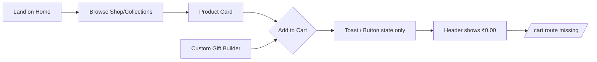

# Gift Shoppe — Accessibility, UX & Performance Audit

**Scope:** `gift-shoppe/src/` (15 source files) and `gift-shoppe/public/` (`index.html`, `robots.txt`, legacy assets under `css/`, `js/`, `img/`)

**Stack:** React 18, React Router v5, CRA, Tailwind (imported but unused in components), DOMPurify

---

## 1. Executive Summary

Gift Shoppe is a visually polished SPA with reasonable semantic structure at the layout level (`header`, `nav`, `main`, `footer`, `section`) and well-labeled form controls in the Custom Gift Builder. However, it behaves more like a marketing prototype than a functional e-commerce app.

**Critical themes:**

| Area | Grade | Summary |
|------|-------|---------|
| **Accessibility** | **D+** | Missing ARIA on icon-only controls, non-keyboard hamburger menu, hover-only “Add to Cart,” multiple `<h1>` per page, invalid `<Link><button>` nesting, no skip link, weak focus styles |
| **UX** | **C-** | Cart/checkout is fake; 15+ header/footer links route nowhere; mobile hides cart/search entirely; no product detail, loading, or empty states |
| **Performance** | **C** | 32+ full-size JPGs without lazy loading; duplicate Google Fonts; 3 icon/font CDNs; no route code-splitting; large legacy `public/` assets shipped in build |
| **SEO** | **D** | Generic meta tags, no Open Graph, no per-route titles, broken manifest paths, client-rendered SPA only |

The Custom Gift Builder is the strongest feature (labels, input sanitization, live price), but its success toast is not announced to screen readers and “Add to Cart” does not persist anything.

---

## 2. Accessibility Findings

| Severity | Location | Issue | WCAG Criterion | Fix |
|----------|----------|-------|----------------|-----|
| **Critical** | `Header.js:34-36` | Hamburger is a `
` — not focusable, not activatable via keyboard | [2.1.1 Keyboard](https://www.w3.org/WAI/WCAG22/Understanding/keyboard) | Use `<button type="button">` with `aria-expanded`, `aria-controls="mobile-nav"`, and `aria-label` |
| **Critical** | `ProductCard.css:46-52`, `ProductCard.js:18-27` | “Add to Cart” overlay is `opacity: 0` until hover — invisible to keyboard/touch users | [2.1.1 Keyboard](https://www.w3.org/WAI/WCAG22/Understanding/keyboard), [2.5.1 Pointer Gestures](https://www.w3.org/WAI/WCAG22/Understanding/pointer-gestures) | Always show button, or show on `:focus-within`; add visible focus ring |
| **Critical** | `Header.js:47-59`, `Header.css:125-127` | Icon-only links (search, account, wishlist, cart) have no accessible names; entire `.header-actions` hidden on mobile ≤900px | [4.1.2 Name, Role, Value](https://www.w3.org/WAI/WCAG22/Understanding/name-role-value), [1.3.1 Info and Relationships](https://www.w3.org/WAI/WCAG22/Understanding/info-and-relationships) | Add `aria-label` to each `Link`; keep essential actions (cart) visible on mobile |
| **High** | `Home.js:16-18`, `Home.js:88-90` | `<Link>` wraps `<button>` — invalid nesting of interactive elements | [4.1.1 Parsing](https://www.w3.org/WAI/WCAG22/Understanding/parsing) (HTML validity) | Use `<Link className="hero-button">` styled as button, or `useNavigate` on a single `<button>` |
| **High** | `Header.js:30`, `Home.js:15`, `Home.js:87` | Three `<h1>` elements on Home (header brand + hero + promo banner) | [1.3.1 Info and Relationships](https://www.w3.org/WAI/WCAG22/Understanding/info-and-relationships) (heading hierarchy) | One `<h1>` per page; demote header logo to `
` or `` inside link |
| **High** | `Header.js:15-24`, `Footer.js:43-45` | Material Icons / Font Awesome used without `aria-hidden`; adjacent text may be insufficient for icon-only cases | [1.1.1 Non-text Content](https://www.w3.org/WAI/WCAG22/Understanding/non-text-content) | `aria-hidden="true"` on decorative icons; ensure visible text or `aria-label` on controls |
| **High** | `CustomGiftBuilder.js:184-197` | Success toast is visual only — not announced to assistive tech | [4.1.3 Status Messages](https://www.w3.org/WAI/WCAG22/Understanding/status-messages) | Add `role="status"` and `aria-live="polite"` |
| **High** | `index.css:13`, site-wide | `--color-text-secondary: #888888` on white ≈ **3.54:1** — fails AA for body text (needs 4.5:1) | [1.4.3 Contrast (Minimum)](https://www.w3.org/WAI/WCAG22/Understanding/contrast-minimum) | Darken to `#767676` or darker; audit `.nav-link`, `.product-price`, footer links |
| **Medium** | `App.js` (no skip link) | No “Skip to main content” link | [2.4.1 Bypass Blocks](https://www.w3.org/WAI/WCAG22/Understanding/bypass-blocks) | Add visually hidden skip link targeting `<main>` |
| **Medium** | `Header.css:120-146` | Mobile nav drawer: no focus trap, no Escape to close, no backdrop, body scroll not locked | [2.4.3 Focus Order](https://www.w3.org/WAI/WCAG22/Understanding/focus-order) | Trap focus in drawer; close on Escape/outside click; restore focus to hamburger |
| **Medium** | `Shop.js:73-91` | Category filter buttons lack `aria-pressed` / `aria-current` | [4.1.2 Name, Role, Value](https://www.w3.org/WAI/WCAG22/Understanding/name-role-value) | `aria-pressed={activeCategory === cat}` on filter buttons |
| **Medium** | `index.css:47-52`, global | No visible `:focus-visible` styles on links/buttons (builder removes outline with custom focus only in `CustomGiftBuilder.css:161-165`) | [2.4.7 Focus Visible](https://www.w3.org/WAI/WCAG22/Understanding/focus-visible) | Global `:focus-visible { outline: 2px solid ... }` |
| **Medium** | `CustomGiftBuilder.js:56-74` | Live preview is icon-only; configuration changes not exposed to screen readers | [1.3.1](https://www.w3.org/WAI/WCAG22/Understanding/info-and-relationships), [4.1.3](https://www.w3.org/WAI/WCAG22/Understanding/status-messages) | Add `aria-live="polite"` region summarizing base item, material, engraving, price |
| **Medium** | `ErrorBoundary.js:24-26` | Error message not marked as alert | [4.1.3 Status Messages](https://www.w3.org/WAI/WCAG22/Understanding/status-messages) | `role="alert"` on error heading/container |
| **Low** | `Header.js:22-24` | “INR (₹)” looks like a dropdown but is a non-interactive `
` | [2.4.4 Link Purpose](https://www.w3.org/WAI/WCAG22/Understanding/link-purpose-in-context) | Either implement currency selector or remove chevron / use plain text |
| **Low** | `Footer.js:43-45` | Social links use `href="#instagram"` etc. — empty hash targets | [2.4.4 Link Purpose](https://www.w3.org/WAI/WCAG22/Understanding/link-purpose-in-context) | Real URLs + `aria-label="GiftShoppe on Instagram"` |
| **Low** | `Home.css:143-151`, `Shop.js:106` | Entrance animations with `opacity: 0` initial state; no `prefers-reduced-motion` | [2.3.3 Animation from Interactions](https://www.w3.org/WAI/WCAG22/Understanding/animation-from-interactions) | `@media (prefers-reduced-motion: reduce) { animation: none; opacity: 1 }` |
| **Low** | `CustomGiftBuilder.css:85-88` | Gold-plated preview text `#fff8dc` on gold gradient may fail contrast | [1.4.3 Contrast](https://www.w3.org/WAI/WCAG22/Understanding/contrast-minimum) | Use darker engraving color on light/gold backgrounds |

**Positive A11y notes:**
- `ProductCard.js:17` — product images have meaningful `alt` from `product.name`
- `CustomGiftBuilder.js:79-167` — form fields use proper `<label htmlFor>` associations
- `App.js:16` — page content wrapped in `<main>`
- `Header.js:38-44` — primary nav uses semantic `<nav>` with `NavLink`

---

## 3. UX Findings

| Severity | Location | Issue | Impact | Fix |
|----------|----------|-------|--------|-----|
| **Critical** | `ProductCard.js:7-12`, `CustomGiftBuilder.js:35-37`, `Header.js:60` | “Add to Cart” only toggles local UI; cart total always `₹0.00`; no cart route in `App.js` | Users cannot complete purchase; false confirmation erodes trust | Implement cart state (Context/reducer), `/cart` route, persistent total |
| **Critical** | `App.js:17-33` vs `Header.js:14-21,47-58`, `Footer.js:17-50` | Routes exist for `/`, `/build`, `/shop`, `/collections`, `/about` only; links to `/cart`, `/search`, `/account`, `/wishlist`, `/track-order`, `/support`, `/new`, `/careers`, `/faq`, etc. are dead | Blank pages or 404 on navigation; broken trust signals in header | Add routes + pages, or remove/disable links until implemented |
| **High** | `Header.css:125-127` | On mobile (≤900px), search, account, wishlist, and cart icons are **hidden** | Mobile users cannot access cart or search at all | Show cart icon in mobile header; move others into drawer |
| **High** | `ProductCard.js` (entire component) | No product detail page; cards are not clickable links | Users cannot view descriptions, sizes, reviews, or share URLs | Add `/shop/:id` route; wrap card image/title in `Link` |
| **High** | `Shop.js:12-14` | Category filter can return 0 results with no empty state | Confusing “Showing 0 Results” with empty grid | Add illustrated empty state + “Clear filters” CTA |
| **High** | `Home.js:55` + `App.js:21-22` | Full `CustomGiftBuilder` embedded on Home **and** on `/build` | Redundant scroll on home; duplicate content on dedicated page | Home: teaser CTA linking to `/build`; full builder only on `/build` |
| **Medium** | `Home.js:84-91` | Promo CTA says “Learn More” but links to `/shop` | Mismatch between promise (“Up to 50% Off”) and destination | Link to sale collection or add promo landing page |
| **Medium** | Entire app | No loading skeletons, spinners, or error UI for data | Perceived slowness; no graceful failure if assets fail | Suspense boundaries, image `onError` fallbacks |
| **Medium** | `About.js:1-17` | Minimal About page; large unused media in `public/img/about/` (incl. **8.5 MB** `1.mp4`) | Missed storytelling opportunity; dead weight in deploy | Use or remove legacy assets |
| **Medium** | `Shop.js:32-38`, `Collections.js:23-30` | Page titles `4.5rem` / `5rem` with limited mobile scaling | Horizontal overflow / cramped layout on small phones | Match `Home.css:154-157` responsive title rules |
| **Low** | `CustomGiftBuilder.js:119` | Placeholder says “Letters/Numbers only” but `. , -` are allowed | Minor expectation mismatch | Align copy with validation regex |
| **Low** | `Header.js:22-24` | Currency selector is non-functional | Appears broken | Implement or remove |
| **Low** | `ErrorBoundary.js:26` | Claims “Our team has been notified” but only `console.error` | Misleading copy | Integrate error reporting or soften message |

**E-commerce user flow assessment:**

Flow breaks at step D — there is no cart, checkout, or order confirmation path.

---

## 4. Performance Findings

| Severity | Location | Issue | Impact | Fix |
|----------|----------|-------|--------|-----|
| **High** | `ProductCard.js:17` | No `loading="lazy"`, `width`/`height`, or `srcSet` | All visible images load eagerly; CLS risk | Add `loading="lazy"`, explicit dimensions, WebP/`srcSet` |
| **High** | `public/img/Products/*.jpg`, `public/img/Items/*.jpg` | Many images **100–580 KB** each (e.g. `n6.jpg` 582 KB, `f1.jpg` 287 KB) | Slow LCP on Shop (32 products) and Home (16 products) | Compress, resize to display size, serve WebP/AVIF |
| **High** | `index.html:21-27`, `index.css:5` | Google Fonts loaded **twice** (HTML link + CSS `@import`) | Duplicate network requests, render-blocking | Single load strategy; `font-display: swap`; subset weights |
| **High** | `index.html:26-27` | Font Awesome Pro + Material Icons full CDN stylesheets | Large render-blocking CSS; unused glyphs | Tree-shake SVG icons or load only needed icons |
| **Medium** | `App.js:1-38` | All routes eagerly imported — no `React.lazy` / `Suspense` | Larger initial JS bundle | `lazy(() => import('./Shop'))` per route |
| **Medium** | `Shop.js:8`, `Home.js:6-7` | `allProducts = [...featured, ...shopByItem]` recreated every render | Minor CPU churn on filter changes | `useMemo` for derived lists |
| **Medium** | `Shop.js:113-124`, `Collections.js:52-57` | Inline `<style>` blocks injected per render | Style recalculation | Move to CSS files |
| **Medium** | `Home.js:84` | External Unsplash background (`w=1920`) | Extra DNS/TLS + large image dependency | Self-host optimized hero image from `public/img/` |
| **Medium** | `public/` legacy assets | Unused `css/form.css` (25 KB), `css/style.css` (22 KB), `js/`, `hero4.png` (858 KB), `about/1.mp4` (8.5 MB) | Bloat in `build/` output | Delete or exclude from CRA `public/` |
| **Medium** | `index.js:21` | `reportWebVitals()` called with no callback | Web Vitals collected but discarded | Pass `console.log` or analytics handler |
| **Low** | `index.css:4-7` | Tailwind imported; no utility classes used in components | Extra CSS in bundle | Remove Tailwind or adopt it consistently |
| **Low** | `firebase.js` | Config present but never imported | Dead code / confusion | Remove or wire up analytics |
| **Low** | `CustomGiftBuilder.js:2` | DOMPurify adds ~20 KB gzipped to bundle | Acceptable for security; note cost | Keep; consider lighter sanitizer if input is regex-only |
| **Low** | `DOMPurify` + `products.js` | Static product data imported on every page using `ProductCard` | All product metadata in main chunk | Acceptable at current scale; code-split Shop data later |

**Image optimization snapshot (from `public/`):**

| Asset pattern | Example size | Used by React? |
|---------------|-------------|----------------|
| `img/Products/f*.jpg` | 65–320 KB | Yes (`products.js`) |
| `img/Items/p*.jpg` | 70–290 KB | Yes |
| `img/hero4.png` | 858 KB | No |
| `img/about/1.mp4` | 8.5 MB | No |

---

## 5. SEO Findings (cross-cutting)

| Severity | Location | Issue | Fix |
|----------|----------|-------|-----|
| **High** | `index.html:8-11` | Generic `description`; no `og:*`, `twitter:*`, or `canonical` | Rich meta per page via `react-helmet-async` or SSR |
| **High** | Entire app | Client-side SPA — crawlers see shell only | Prerender critical routes or migrate to SSR/SSG |
| **High** | `index.html:13,19` vs `public/img/favicon/` | References `%PUBLIC_URL%/manifest.json`, `favicon.ico`, `logo192.png` at root — **files missing at those paths** | Point to `img/favicon/site.webmanifest`, correct icon paths |
| **Medium** | `public/img/favicon/site.webmanifest` | `"name": ""`, `"short_name": ""`, icon paths `/android-chrome-*.png` (wrong) | Fill names; fix icon `src` paths |
| **Medium** | No per-route `<title>` | All pages titled “GiftShoppe” | Dynamic titles: “Shop \| GiftShoppe”, etc. |
| **Low** | `robots.txt:1-3` | Allows all; no `sitemap.xml` | Add sitemap for indexable routes |
| **Low** | Product listings | No JSON-LD `Product` schema | Add structured data on shop/product pages |

---

## 6. Quick Wins (Top 10)

1. **Replace hamburger `
` with `<button aria-expanded aria-label="Menu">`** — `Header.js:34-36`
2. **Make “Add to Cart” always visible** (remove hover-only overlay) — `ProductCard.css:46-52`
3. **Add `aria-label` to icon-only header links** (Search, Account, Wishlist, Cart) — `Header.js:47-59`
4. **Fix `<Link><button>` anti-pattern** on hero CTAs — `Home.js:16-18, 88-90`
5. **Add `loading="lazy"` to all product `` tags** — `ProductCard.js:17`
6. **Darken `--color-text-secondary` from `#888` to `#595959`** for AA contrast — `index.css:13`
7. **Add `role="status" aria-live="polite"` to cart success toast** — `CustomGiftBuilder.js:184-197`
8. **Remove duplicate Google Fonts load** (keep HTML link OR CSS import, not both) — `index.html:21-23`, `index.css:5`
9. **Show cart icon on mobile** (don’t hide entire `.header-actions`) — `Header.css:125-127`
10. **Fix broken manifest/favicon paths** in `index.html:5-6,13,19` to match `public/img/favicon/`

---

## Appendix: File Inventory Reviewed

**`src/`:** `App.js`, `index.js`, `index.css`, `Header.js/css`, `Footer.js/css`, `Home.js/css`, `Shop.js`, `Collections.js`, `About.js`, `ProductCard.js/css`, `CustomGiftBuilder.js/css`, `ErrorBoundary.js`, `data/products.js`, `firebase.js`, `reportWebVitals.js`, tests

**`public/`:** `index.html`, `robots.txt`, legacy `css/`, `js/`, `img/` (products, items, banners, about media, favicons)

---

---

*Report generated by specialized audit agent — React Shoppe Full Application Audit, June 28, 2026*
